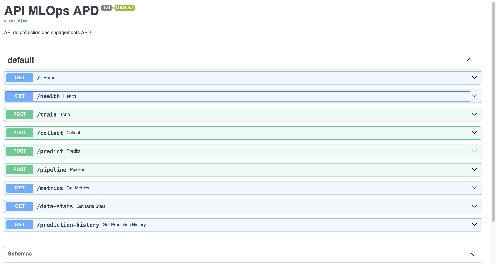
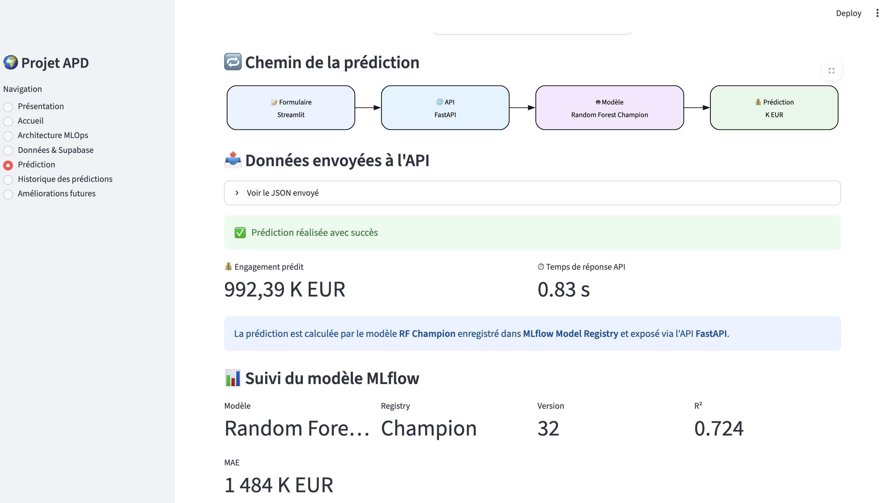
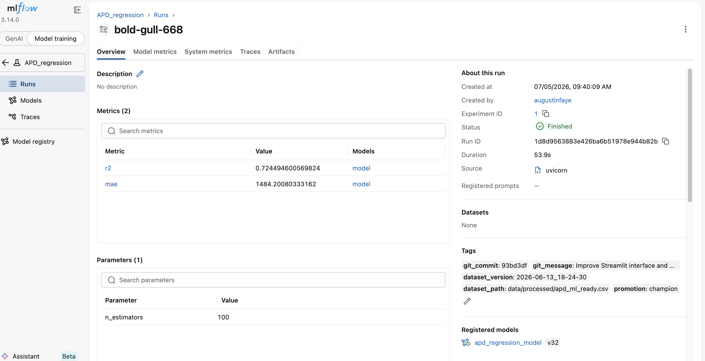

# 📊 Projet APD – Plateforme MLOps de prédiction de l'Aide Publique au Développement

## 📖 Présentation

Ce projet a été réalisé dans le cadre d'une étude MLOps visant à prédire les **engagements de l'Aide Publique au Développement (APD)** à partir de données ouvertes.

L'objectif est de mettre en place une chaîne MLOps complète allant de l'entraînement du modèle jusqu'à son déploiement en production.

Le projet intègre :

- 📊 Prétraitement des données
- 🤖 Machine Learning (Random Forest Regressor)
- 📈 MLflow Tracking & Model Registry
- 🗄️ Supabase PostgreSQL pour le backend MLflow
- 🚀 API REST FastAPI
- 🌐 Interface utilisateur Streamlit
- 🐳 Docker
- ⚙️ GitHub Actions (CI/CD)

---

# 🏗️ Architecture MLOps

```
                  Utilisateur
                       │
                       ▼
                🌐 Streamlit
                       │
                       ▼
                 🚀 FastAPI API
                       │
                       ▼
        MLflow Model Registry (Champion)
                       │
                       ▼
             Random Forest Regressor
                       │
                       ▼
         Supabase PostgreSQL (Tracking)
```

---

# 📂 Structure du projet

```
Agence_Dvpt/

├── api/
├── app/
├── data/
├── docs/
├── etl/
├── ingestion/
├── models/
├── notebooks/
├── preprocessing/
├── scripts/
├── tests/
├── .github/
│   └── workflows/
├── Dockerfile
├── requirements.txt
└── README.md
```

---

# 🚀 Fonctionnalités

## Prétraitement

- Nettoyage des données APD
- Préparation des variables
- Construction du dataset final

---

## Machine Learning

Le modèle utilisé est un :

**Random Forest Regressor**

Objectif :

Prédire les **Engagements (K EUR)**.

---

## MLflow

Le projet utilise MLflow pour :

- suivre les expériences
- enregistrer les paramètres
- enregistrer les métriques
- sauvegarder les artefacts
- gérer les versions des modèles
- promouvoir automatiquement le modèle **Champion**

---

## Supabase

Le backend MLflow est connecté à une base PostgreSQL hébergée sur Supabase afin de conserver :

- les runs
- les paramètres
- les métriques
- les versions des modèles

---

## API FastAPI

L'API permet :

### Vérification

```
GET /health
```

Retour :

```json
{
   "status":"ok",
   "message":"API disponible"
}
```

---

### Prédiction

```
POST /predict
```

Retour :

```json
{
   "prediction": ...
}
```

Le modèle utilisé est automatiquement le modèle **Champion** enregistré dans MLflow.

---

### Entraînement

```
POST /train
```

Déclenche un nouvel entraînement du modèle et enregistre le résultat dans MLflow.

---

# 🌐 Interface Streamlit

L'application Streamlit permet :

- saisir les caractéristiques d'un projet APD
- envoyer les données à l'API
- afficher la prédiction
- afficher le modèle Champion utilisé
- afficher les métriques du modèle
- consulter l'historique des prédictions

---

# 📈 Résultats du modèle Champion

| Indicateur | Valeur |
|------------|--------|
| Modèle | Random Forest |
| Version MLflow | v32 |
| Statut | Champion |
| R² | 0.724 |
| MAE | 1484 K EUR |

---

# ⚙️ Installation

```bash
git clone https://github.com/AFolsig/Agence_Dvpt.git

cd Agence_Dvpt

python -m venv agence

source agence/bin/activate

pip install -r requirements.txt
```

---

# ▶️ Lancer l'API

```bash
uvicorn api.main:app --reload
```

Documentation Swagger :

```
http://127.0.0.1:8000/docs
```

---

# ▶️ Lancer Streamlit

```bash
streamlit run app/streamlit_app.py
```

---

# ▶️ Lancer MLflow

```bash
mlflow ui \
--backend-store-uri $MLFLOW_TRACKING_URI \
--host 127.0.0.1 \
--port 5001 \
--allowed-hosts "*"
```

---

# 🔄 Intégration Continue

Le projet utilise **GitHub Actions**.

À chaque `git push` sur la branche **main**, le workflow CI :

- installe les dépendances
- vérifie le projet
- valide le pipeline CI/CD

---

## Monitoring & Remédiation automatique

Le projet intègre un système de monitoring basé sur Evidently AI permettant de détecter les dérives des données.

### Fonctionnalités

- Génération automatique d'un rapport HTML et JSON avec Evidently.
- Intégration du rapport dans l'interface Streamlit.
- Détection des colonnes présentant une dérive statistique.
- Seuil de remédiation personnalisé fixé à 5 % de colonnes en dérive.
- Script `monitoring/check_drift_and_retrain.py` analysant automatiquement le rapport.
- Mode simulation (par défaut) afin d'éviter tout réentraînement involontaire.
- Réentraînement automatique disponible avec :

```bash
python monitoring/check_drift_and_retrain.py --execute
```

### Résultat obtenu

- 35 colonnes analysées.
- 2 colonnes détectées en dérive.
- Part des colonnes en dérive : **5.71 %**.
- Le seuil personnalisé de **5 %** déclenche une demande de remédiation.
- Un historique des actions est enregistré dans les journaux de monitoring.

# 🔮 Perspectives d'amélioration

- Réentraînement automatique avec Airflow
- Déploiement cloud complet
- Kubernetes
- Authentification renforcée
- Tests unitaires supplémentaires

---

# 📚 Technologies utilisées
   
- Python
- Pandas
- NumPy
- Scikit-Learn
- FastAPI
- Streamlit
- MLflow
- Supabase PostgreSQL
- Docker
- Git
- GitHub Actions
   
---

# 👥 Auteurs

Projet réalisé par :

- **Augustin FAYE**
- **Mohamed AFIRI**

---

# 📸 Aperçu de la plateforme

## 🌐 API FastAPI

L'API REST permet d'entraîner le modèle, d'effectuer des prédictions, de consulter les métriques et d'accéder à l'historique des prédictions via une documentation Swagger interactive.



---

## 💻 Interface Streamlit

L'application Streamlit constitue l'interface utilisateur du projet. Elle permet d'envoyer des données à l'API FastAPI, d'obtenir une prédiction et d'afficher les informations du modèle Champion enregistré dans MLflow.



---

## 📈 Suivi des expériences avec MLflow

MLflow assure le suivi des expériences d'entraînement, l'enregistrement des métriques, des paramètres, des artefacts ainsi que le versionnement des modèles. Le modèle Champion est automatiquement utilisé par l'API pour les prédictions.



---
